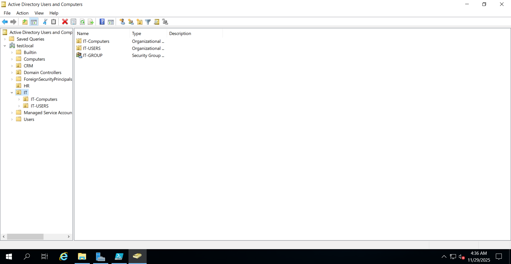
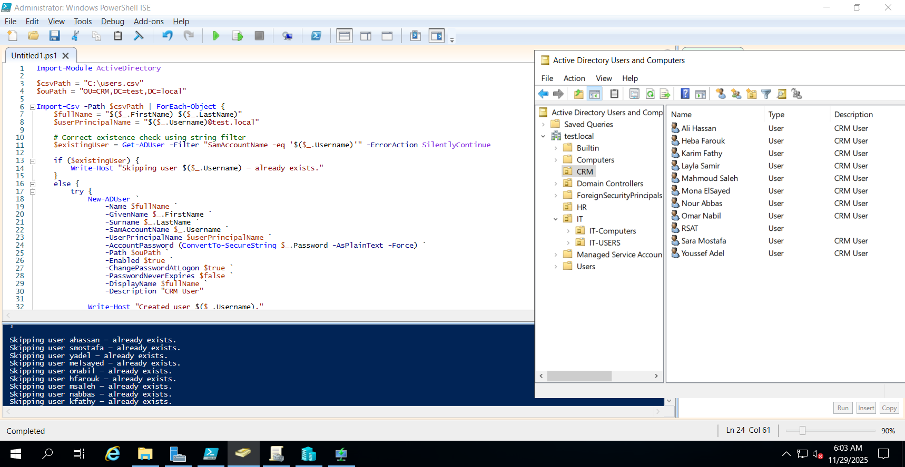
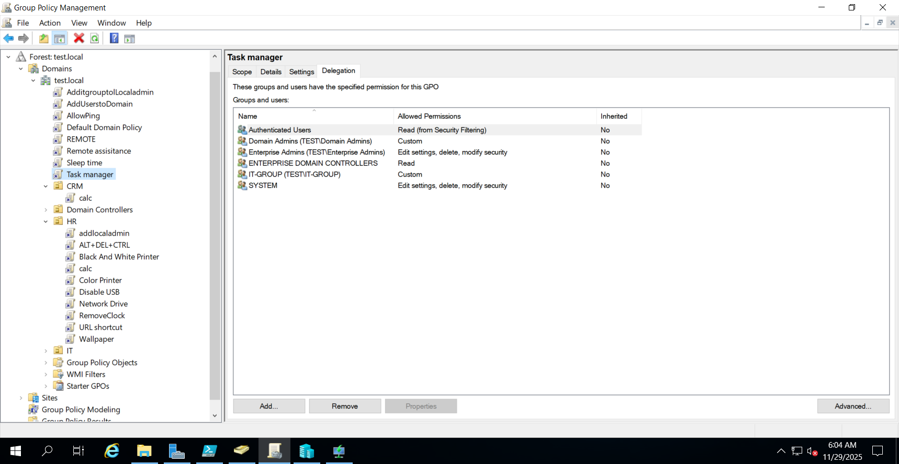
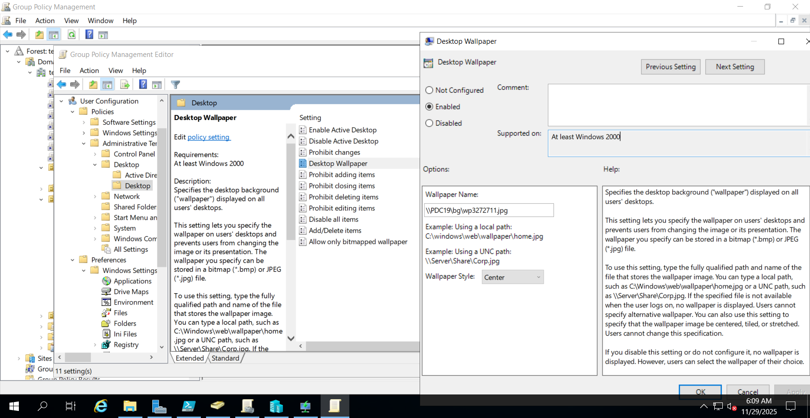
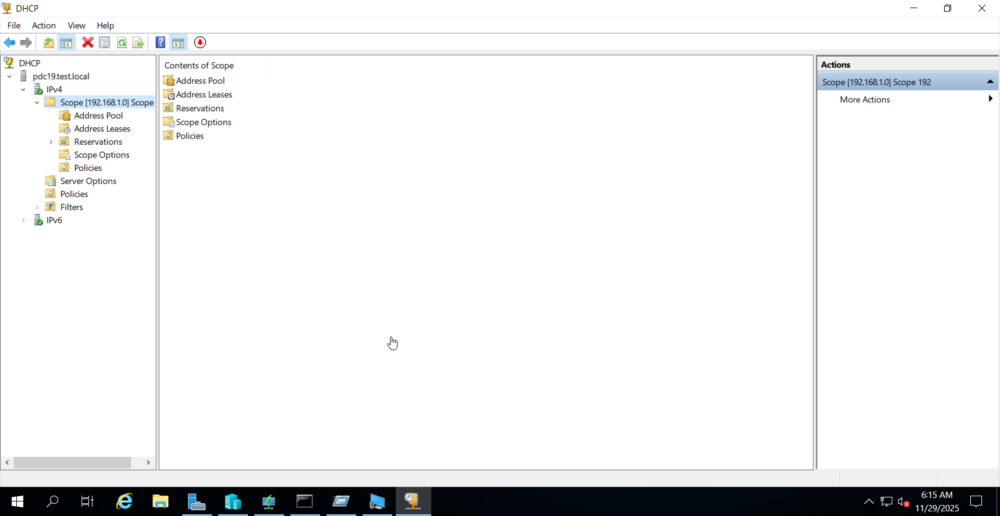
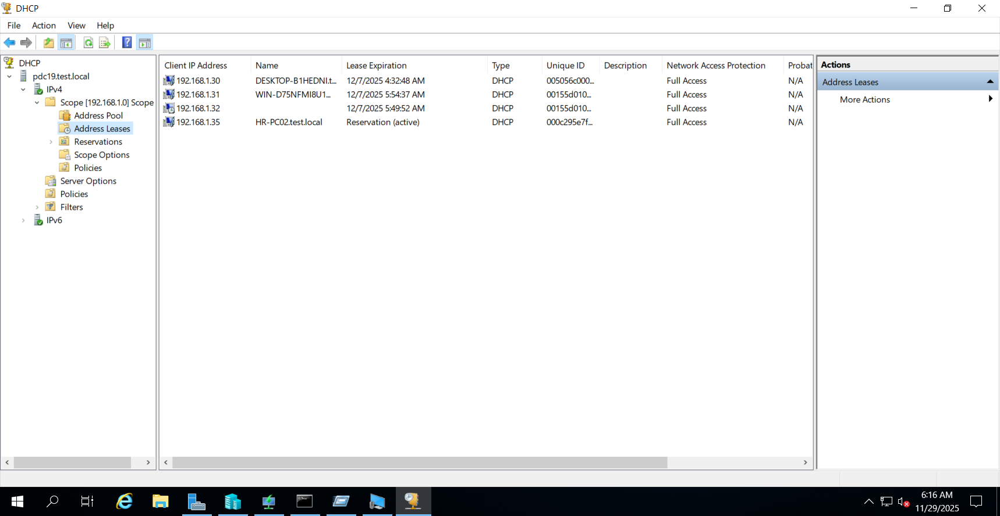
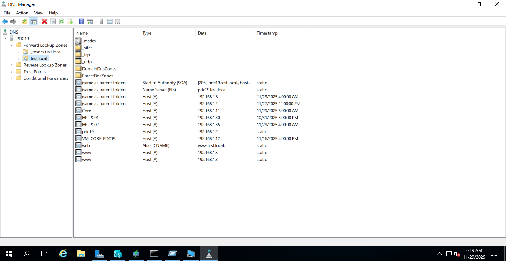
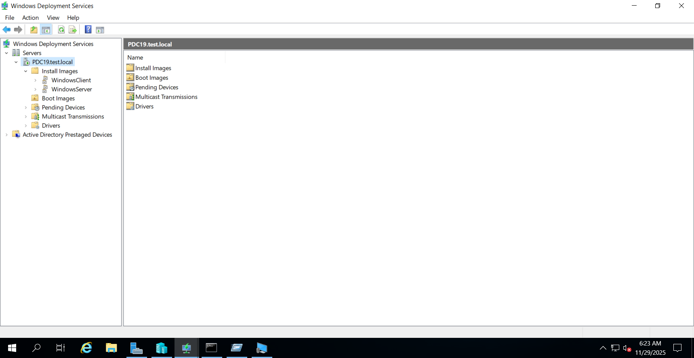
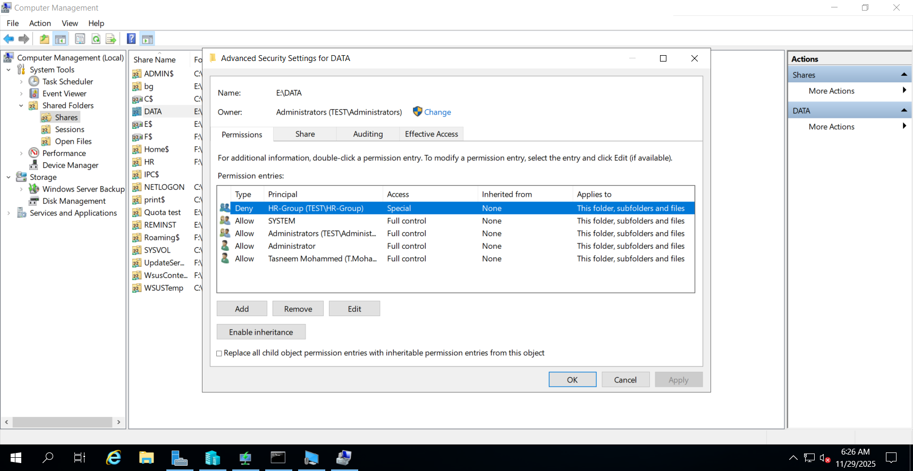
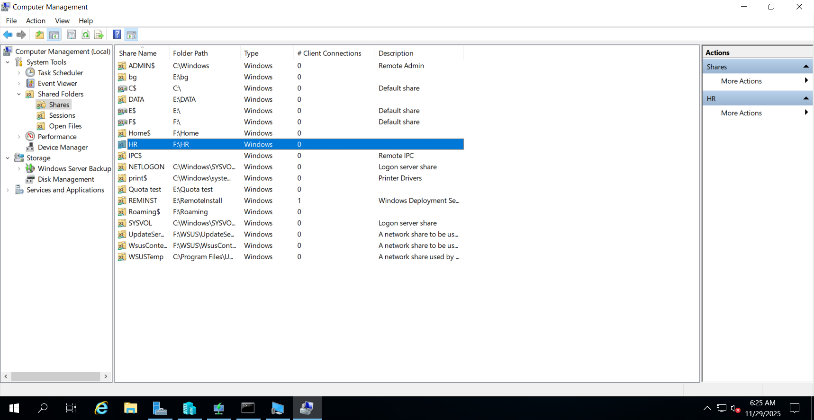

# Windows Server Enterprise Homelab

A fully-built Windows Server homelab designed to simulate a real-world enterprise environment.
This project demonstrates advanced skills in Active Directory, Group Policy, DHCP, DNS, WSUS, WDS, Hyper-V, and domain automation using PowerShell and batch scripts.

---

## 🌐 **Lab Overview**

This homelab replicates a small enterprise network with:

* **1 Primary Domain Controller (DC01)**
* **1 Additional Domain Controller (DC02)**
* **DHCP Server**
* **DNS Server**
* **WSUS Server**
* **WDS Server**
* **Hyper-V Virtualization Host**
* **Shared Network Storage**
* **Multiple Domain-Joined Windows Clients**
* **Automated Security and Administrative Policies via GPO**

---

## 🧩 **Core Features & What I Built**

### 🏛️ **Active Directory**

* Created a new forest and domain.
* Added and configured an **additional domain controller** for redundancy.
* Built a full OU structure (IT, HR, Sales, Clients, Servers, etc.).
* Bulk-created users via **PowerShell**, assigning them to OUs automatically.
* Created and managed **security groups** based on department and permissions.

---

### 🛡️ **Group Policy Management**

Implemented multiple GPOs, including:

* Password and lockout policies
* Default app associations
* Drive mappings
* Login banners
* Desktop restrictions
* Firewall configurations
* WSUS update policies
* Script-based computer startup and shutdown tasks
* Local administrator management

---

### ⚙️ **Automation & Scripting**

Scripts included in this repository:

* **Bulk User Creation Script (PowerShell)**
* **OU Assignment Script**
* **Local Admin Automation Script (GPO startup)**
* **Script to disable local non-domain admin accounts**
* **Script to force-remove stuck files on network shares**
* **Service monitoring / restart script**

---

### 🖧 **DHCP**

* Built and configured a DHCP server.
* Created custom scopes (VLANs optional).
* Configured reservations, exclusions, and options.
* DHCP failover with secondary DC (optional).

---

### 🌍 **DNS**

* Configured an internal forward lookup zone.
* Added necessary SRV records for AD.
* Created host records for servers and services.
* Integrated reverse lookup zone for PTR validation.

---

### 📦 **WSUS**

* Installed and configured WSUS.
* Synced products, classifications, and updates.
* Applied WSUS GPO to clients and servers.
* Created auto-approval rules.

---

### 💾 **WDS**

* Installed and configured Windows Deployment Services.
* Added boot and install images.
* Configured PXE boot for automated OS deployment.
* Integrated with DHCP.

---

### 🗄️ **File Services**

* Created a shared network folder with NTFS and Share permissions.
* Configured Access-Based Enumeration (optional).
* Created department-based shares and permissions.
* Tested NTFS inheritance & troubleshooting (included in notes).

---

### 🖥️ **Hyper-V Virtualization**

* Created, managed, and migrated VMs (including nested Hyper-V notes).
* Configured virtual switches.
* Set up test environments for WDS and domain-joined PCs.

---

### **Active Directory**

* OU structure
  `
* Bulk-created users
  `
* Group memberships
  `

### **Group Policy**

* GPO list overview
  `
* Policy example
  `
* Local admin assignment script GPO
  `

### **DHCP**

* Scope setup
  `
* Lease list
  `

### **DNS**

* Forward lookup zones
  `
* SRV records
  `
* Reverse lookup zone
  `

### **WSUS**

* Sync configuration
  `
* Update approvals
  `

### **WDS**

* PXE boot screen
  `
* Boot/install image list
  `

### **Hyper-V**

* Virtual switch manager
  `
* VM configuration screen
  `

### **File Server**

* NTFS permissions example
  `
* Shared folder configuration
  `

---

## 🧠 **Purpose of This Lab**

This homelab was created to:

* Learn Windows Server administration
* Practice enterprise-level IT concepts
* Build automation and troubleshooting skills
* Prepare for Microsoft certifications
* Strengthen my portfolio and resume

---
